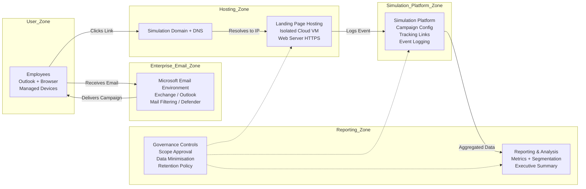
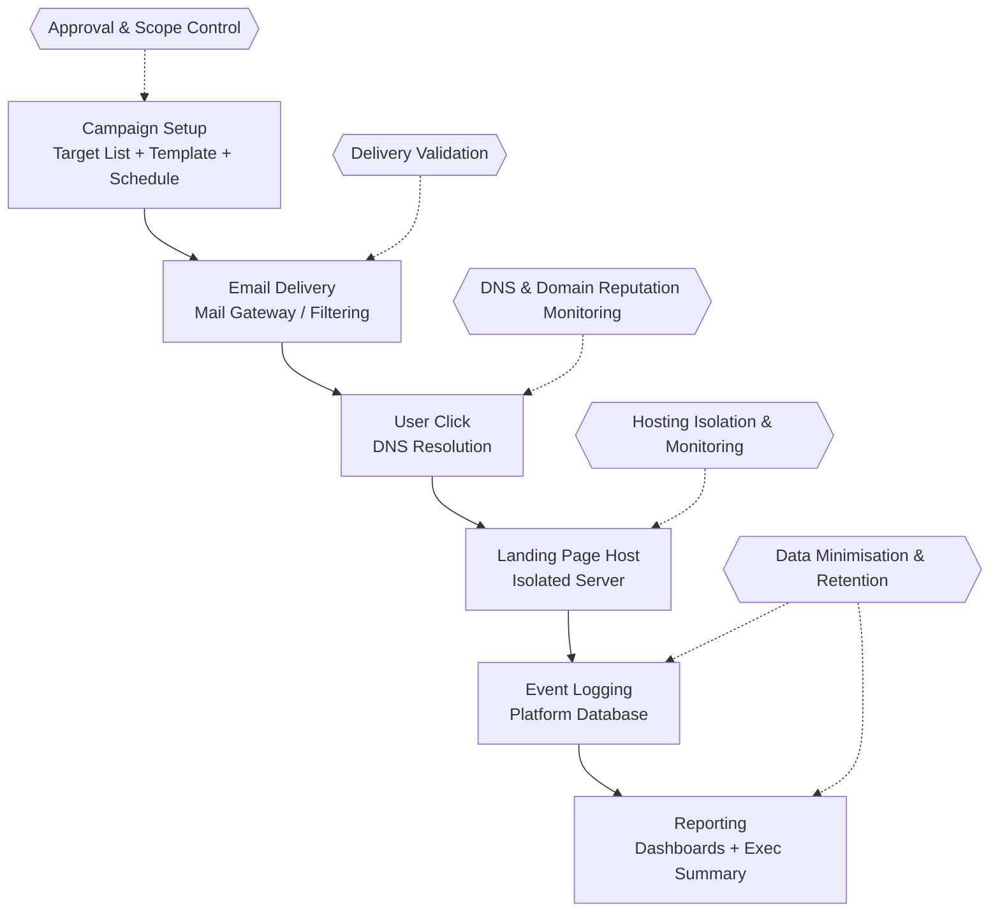
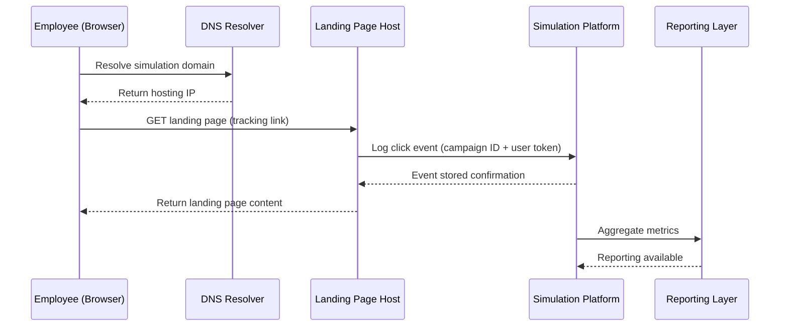

# Architecture Diagram – Internal Phishing Simulation (Defensive)

This document provides **visual architecture diagrams** for an authorised internal phishing simulation.
It focuses on **clarity**, **risk isolation**, and **governance controls**.

---

## 1) System Context Diagram (Components & Boundaries)

### How to explain this in interviews (30 seconds):

  - Users interact via Outlook and browser

  - Email flow is governed by Microsoft filtering controls

  - Domain/DNS routes users to an isolated landing page host

  - Platform logs events and feeds reporting

Governance overlays define scope, data boundaries, and retention
---
## 2) Control Points Diagram

This diagram shows where risks may occur and how they are mitigated.

#### What technical reviewers look for:

  - You know where risks occur (delivery blocked, DNS issues, host misconfig, over-collection)

  - You have controls (approval gates, test batches, isolation, monitoring, data limits)
---
## 3) End-to-End Sequence Diagram

### Interview follow-up hooks:

  - What if DNS fails? (control point: DNS config & monitoring)

  - What if email is blocked? (control point: delivery validation / scoped whitelisting)

  - What data is stored? (control point: data minimisation / retention)

--
## 4) Defensive Design Principles

- Separate simulation domain from production domain.

- Isolate hosting environment from internal systems.

- Limit data collection to behavioural metrics.

- Ensure governance approval before launch.

- Notify SOC before campaign to avoid false escalation.

- Define decommission plan post-campaign.

--
## 5) Interview Talking Points

Infrastructure Focus:

- Why isolate hosting?

- What happens during DNS resolution?

Security Operations Focus:

- How to prevent false positive incident escalation?

Cloud Focus:

- How to scale hosting if campaign size increases?

Governance Focus:

- Where approval checkpoints exist in the workflow?

- How is data minimisation enforced?
